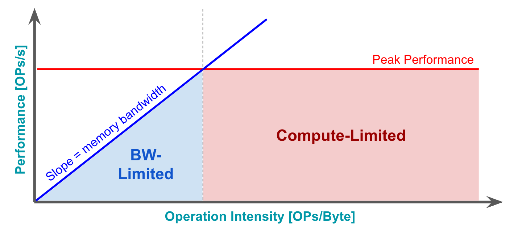

### ECE5545 Machine Learning Hardware and Systems

# Assignment 1: Roofline Plots and Hardware Benchmarking

`"It would appear that we have reached the limits of what it is possible to achieve with computer technology, although one should be careful with such statements, as they tend to sound pretty silly in 5 years." -- Jon Von Neumann`

Assigned on: Monday February 6th    
**Due: Monday February 20th**

Total marks = 10/100    
(-2 marks per day late)

----

  

Do online research and coding to complete the following tasks. You will need to submit **(1) the code used to plot and calculate the requested metrics and plots, and (2) a detailed assignment writeup describing your methodology, showing your calculations and citing any reference or online material that you used**. The submitted code should be executable (for example, a Jupyter Notebook) and it should be sufficient to reproduce all of the results in your assignment write-up. Please make sure to clearly denote the different sections in your notebook(s), either by using markdown headers in text fields or by using separate files for each section.

In this assignment, we will focus on understanding and comparing the computation and memory capabilities of different computer chips under different workloads. By benchmarking popular DNNs, we will also understand the performance, efficiency and hardware utilization of important DNNs on common hardware. Note that throughout this assignment, you can simply use random tensors when measuring the performance of DNNs.

1. Chip Analysis
    * Find the peak FLOPs/s and memory bandwidth of at least 10 different chips. Please choose a diversity of hardware platforms including at least a CPU, a GPU, an ASIC and an SoC. Map and label them on a roofline plot. Note that you may use more than one (optionally log-scale) plot if that makes your visulization clearer, for example, one plot can be used to visualize data-center chips and the other for mobile-phone chips. Include how you computed the peak FLOPs/s and memory bandwidth of each chip and/or cite any sources that you have used. Comment briefly on how different chips compare to each other.
2. DNN Compute and Memory Analysis
    * **2.1** Pick at least 10 different DNNs to analyze. You may use `torchvision`, `torchaudio`, `pytorchcv` or any available model definitions. 
    * **2.2** Find the number of FLOPs and memory footprint of each model and calculate the operational intensity. Note that you may use any PyTorch-compatible libraries to compute these values (for example `thop`, `torchsummary`, `ptflops` or others. Visualize the results using bar charts or other chart types as you see fit. The idea is to visually compare the models in an easy way.
    * **2.3** Overlay the operational intensity on the roofline plots of the CPU and GPU that you have access to on Colab.
    * **2.4** Comment on which workloads are memory/compute bound on different hardware targets.
3. DNN Performance Benchmarking
    * **3.1** Plot the inference latency (at batch sizes = {1,64,256}) vs. FLOPs of each model from part 2 on both the CPU and GPU that you have access to on Colab. You may find it useful to color the points on the plot based on batch size and perhaps label the points on the plot with the model name. It is important to produce an easily-readable plot.
    * **3.2** Repeat the point above but put parameters on the x-axis instead of FLOPs.
    * **3.3** Compute the rank correlation coefficient between (1) CPU latency, (2) GPU latency, (3) FLOPs and (4) parameters. Visualize this as a 2D matrix of correlation values. You may use either Spearman's or other rank correlation coefficients. 
    * **3.4** Comment on whether FLOPs or parameters are a good estimate of how fast the model runs. Explain, with examples, why FLOPs/parameters could in some cases be an accurate indicator of latency, and why in other cases it isn't.
    * **3.5** Plot the throughput of your DNNs on CPU/GPU at different batch sizes.
4. Hardware Utilization and Peak Performance
    * **4.1** Go back to the CPU/GPU rooflines from part 2 and plot the *actual* performance (at different batch sizes) of each model on the roofline.
    * **4.2** Comment on any gaps between peak and achieved performance.
5. Inference vs training
    * **5.1** We would like to experimentally determine the ratio of computation that goes to the forward pass vs. the backward pass of a DNN. Compute the FLOPs and measure the runtime so _some_ of your selected DNNs from part 2 when performing a backward pass. Compute the ratio of forward:backward pass, both in terms of FLOPs and latency. Choose a reasonable training batch size to complete this part. Comment on this ratio for different models.
    * **5.2** For both the forward and backward passes, plot pie charts depicting the breakdown of latency, flops and memory footprint for each layer type in your chosen DNNs.
