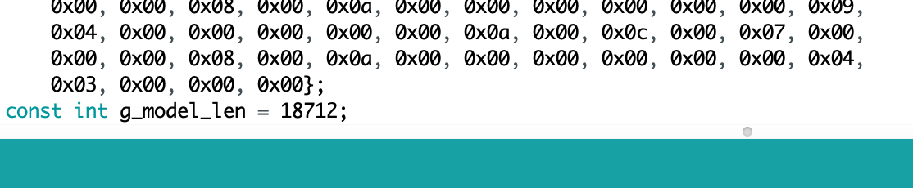

# Deploy your model to Nano 33 BLE board

#### Step 1
Open the micro_speech sketch under Examples -> Arduino_TensorFlowLite -> micro_speech. 
<p align="left">
  
</p>

#### Step 2
Connect your board. Then compile and upload the code to your board by clicking the arrow on the top left of the screen. Alternatively, you can verify your code first by clicking the check mark then the arrow. 
<p align="left">
  
</p>
Try saying yes, no, and any other words to see if the program correctly identifies the words you are saying as “yes”, “no”, “unknown”, or “silence”. 

#### Step 3
After the code is successfully uploaded to your board, open the Serial Monitor by clicking the icon on the top right. You may need to reconnect your port.
<p align="left">
  
</p>
<p align="left">
  
</p>
If your board is not responsive enough, you can lower its detection threshold. Locate the file recognize_commands.h. On line 135, you will see where the detection_threshold parameter is set. If you lower the value, your board will become more responsive, but it will also have a higher false positive rate. You will need to recompile after adjustment.

#### Step 4
Find the file micro_features_model.cpp under the same directory with the micro_speech.ino file. You will see a variable named g_model. Once you have finished running the model_conversion  notebook, you will have a file in .cpp format. Open or print out the file in your terminal using “cat”. You will find a dictionary of bytes for your own model, and also an integer indicating the length of your model. Replace the default g_model with your own model, and g_model_len with your own model’s length. Make sure the variable types are still the same: const unsigned char g_model and const int g_model_int.
<p align="left">
  
</p>
<p align="left">
  
</p>


#### Step 5
Our model requires some additional op resolvers than the default model provided in the micro_speech example. Therefore, we need to modify the op resolver part in micro_speech.ino as follows:
```
static tflite::MicroMutableOpResolver<6> micro_op_resolver(error_reporter); 
  if (micro_op_resolver.AddFullyConnected() != kTfLiteOk) {
    return;
  }
  if (micro_op_resolver.AddSoftmax() != kTfLiteOk) {
    return;
  }
  if (micro_op_resolver.AddReshape() != kTfLiteOk) {
    return;
  }
  if (micro_op_resolver.AddConv2D() != kTfLiteOk) {
    return;
  }
  if (micro_op_resolver.AddTranspose() != kTfLiteOk) {
    return;
  }
  if (micro_op_resolver.AddPad() != kTfLiteOk) {
    return;
  }

```
#### Step 6
Upload your model to the board using the same process in Step 2.
