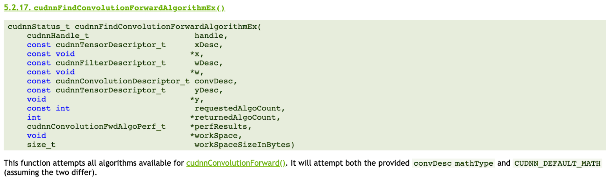

### ECE 5545 Machine Learning Hardware and Systems

# Assignment 4: Implementations and Approximations of DNN Primitives

`"Technology is a useful servant but a dangerous master." -- Christian Lous Lange, Historian`

Assigned on: Wednesday April 13th    
**Due: Monday May 2nd**

Total marks = 16/100    
(-2 marks per day late)

----

## Overview

There are different ways of implementing convolutions and linear layers by factorizing the mathematical operations differently (multiplications and additions), or by using transformations to different numerical domains (such as the log or frequency domain). In this assignment we will perform different implementations of linear and convolution primitives. Next we will explore the accuracy implications, especially at low precision when using some of these transformations. Finally, we will investigate the potential speedup of each approach. Modern deep learning libraries like CuDNN typically have different kernel implementations such as the ones in this assignment, and there are library calls to try them all out and select the best one experimentally (see image above).

## Implementation & Write-up

1. Implement `im2col`, `winograd` and `fft` in `src.conv2d`.
2. Implement `svd` and `logmatmul` in `src.matmul`.

For both. (1) and (2) above, there are functionality tests provided in this assignment to check that your implementations are correct. In general, you are required to use python code to implement each of those functions with 2 exceptions. (1) For singular value decomposition (SVD) where you are allowed to use `numpy` or other libraries to perform the decomposition itself. (2) For `fft`, you may use an FFT2D or similar functions from `pytorch` or other libraries. However, keep in mind that there is more to implementing a convolution in the FFT domain than just conversion. For the `FFT` problem in particular, please describe your implementation in your writeup.

3. Perform an investigation of numerical precision in the provided notebook `1-numerical_precision.ipynb`. We would like to investigate whether there is a _reconstruction error_ introduced by using these alternative kernel implementations. For each transform, plot the reconstruction error vs. numerical precision and compare it to the naive implementation. Comment on any loss of accuracy.
4. SVD is a special transformation because it actually results in more computations. However, after SVD decomposition, we can remove singular values for low-rank matrices to approximate the matrix without losing too much accuracy. Notebook `2-svd_rank.ipynb` has placeholders for investigating the accuracy and speedup of the SVD-transformed matrices for different kinds of input. Complete the notebook, plot accuracy vs. rank for different inputs and speedup vs. rank. Comment on your results.

For parts (3) and (4), include the plots in your writeup along with your commentary on the results.

5. You will now apply SVD to a small neural network performing digit recognition. Instead of measuring the reconstruction error, we will instead measure the impact on accuracy (which is ultimately what we care about). Plot the compression ratio vs. accuracy and the compression ratio vs. measured runtime. Combine the two plots in another plot that has runtime on the x-axis and accuracy on the y-axis. We have provided the file `mnist.py` for you to perform your accuracy and speed investigation. In your writeup, paste your final plots and comment on the observed trends. Note that you will actually have to change the model to perfrom a modified matrix multiplication. For SVD, we have 3 matrices instead of 1--think about how you want to implement this to get the best speedup and explain your custom layer implementation in the writeup.

6. [optional] **Extra Credit (1 bonus mark):**  In part (2), you implemented `logmatmul` most likely by multiplying in the log domain then converting back out of the log domain before the addition. For extra credit, implement NVidia's patentented version of doing approximate addition in the log domain found [here](https://uspto.report/patent/app/20210056446). Explain your implementation and test its reconstruction error at different numerical precisions.
